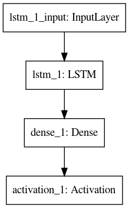
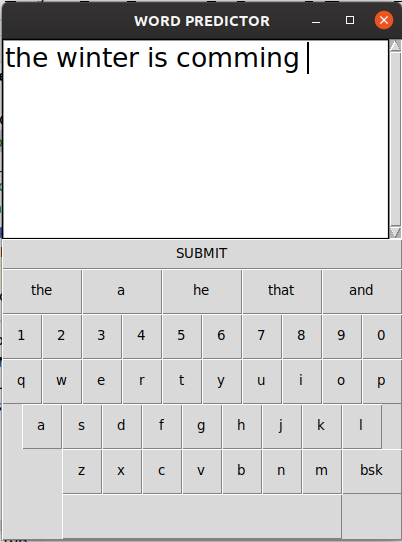

# Next Word Predictor 
A Deep Learning Model to predict next word in a sequence using LSTM.

The Application is created using Tensorflow and Python.


## Getting Started
- Clone the repo and cd into the directory
```sh
$ git clone https://github.com/raj713335/Next_Word_Predictor.git
$ cd Next_Word_Predictor
```

## The training data is present in the corpus.txt file.


## The WordCloud of the traing Data


## Install tensorflow and all the other required libraries 

```sh
$ pip install tensorflow, keras 

import numpy as np
from nltk.tokenize import RegexpTokenizer
from keras.models import Sequential, load_model
from keras.layers import LSTM
from keras.layers.core import Dense, Activation
from keras.optimizers import RMSprop
import matplotlib.pyplot as plt
import pickle
import heapq
import tensorflow as tf
from wordcloud import WordCloud, STOPWORDS
import numpy as npy
from PIL import Image
```

## Now To train the Model Enter to the NLP_DEEP_LEARNING FOLDER and then again to the sub directory CODE and run the Model Creator.py file

```sh
$ cd NLP_DEEP_LEARNING
$ cd CODE
$ python Model Creator.py
```


## The Summary of the model created


```sh
Model: "sequential_1"
_________________________________________________________________
Layer (type)                 Output Shape              Param #   
=================================================================
lstm_1 (LSTM)                (None, 128)               749056    
_________________________________________________________________
dense_1 (Dense)              (None, 1334)              172086    
_________________________________________________________________
activation_1 (Activation)    (None, 1334)              0         
=================================================================
Total params: 921,142
Trainable params: 921,142
Non-trainable params: 0
_________________________________________________________________
```




# Now To run the Model keras_next_word_model.h5 run the Output.py file

```sh
$ python Output.py
```

After that in command line you can enter the input for which you want to check the output.


# NOW TO RUN THE GUI VERSION OF THE WORD_PREDICTOR



```sh
$ cd ..
$ cd ..
$ cd GUI
$ python GUI_WP.py
```


# Thank You !


